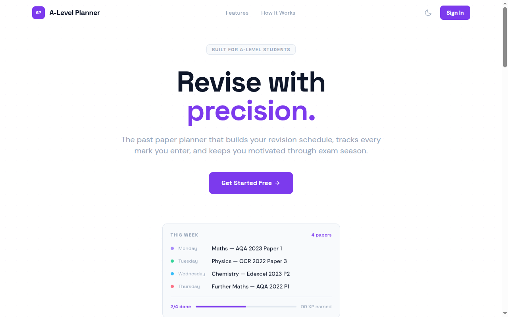
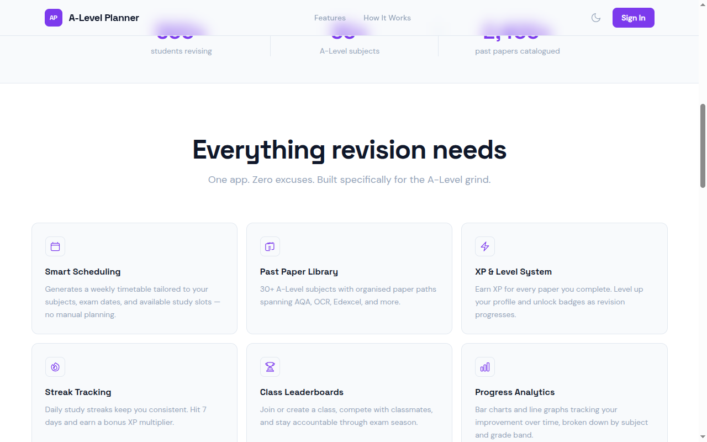
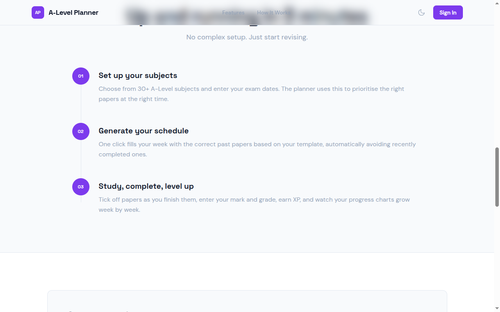
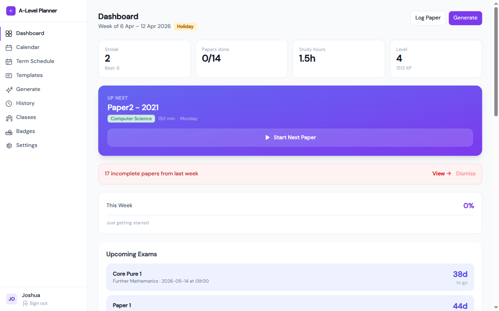
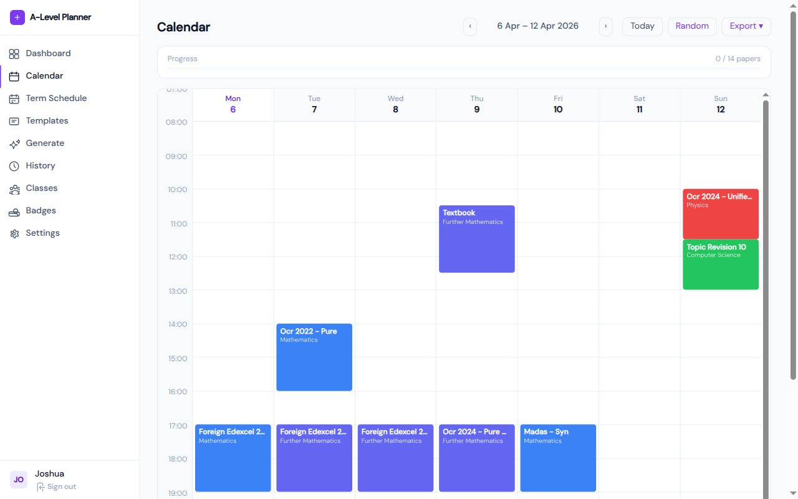
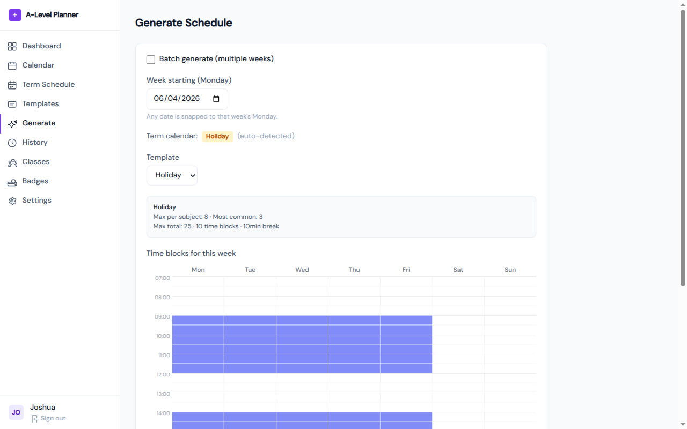
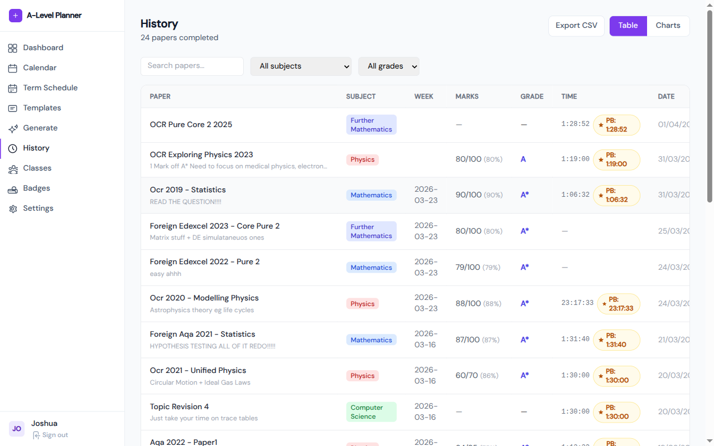
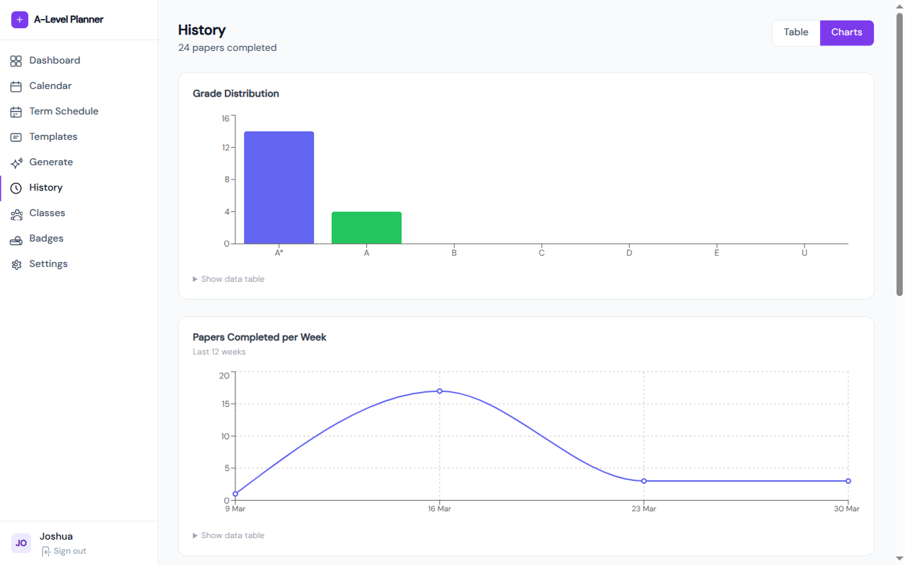
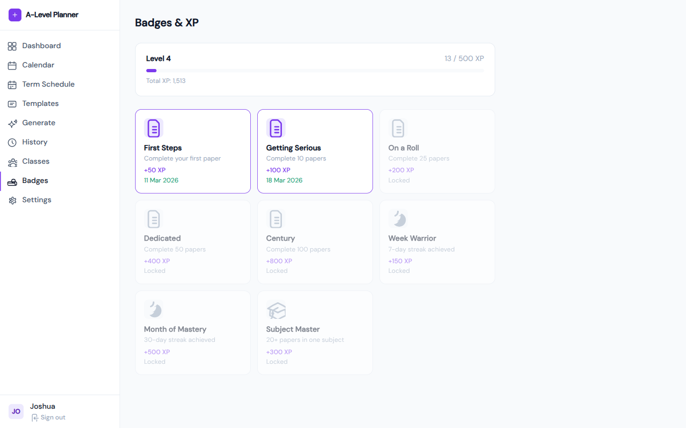

# A-Level Revision Planner

[](https://github.com/WithoutTheDot/alevel-revision-planner/actions/workflows/ci.yml)

**Live demo:** https://pastpapers-a8b7v6-f7f04.web.app/

A full-stack web application that helps A-Level students build structured, personalised revision schedules — tracking every past paper they complete, visualising progress over time, and staying motivated through gamification.

Built with React 19, Firebase, and Tailwind CSS.

---

## Motivation

During A-Level revision I found myself manually deciding which past paper to do each day, losing track of what I'd already completed, and having no way to see whether my marks were improving. I built this to solve all three problems in one place — generating a weighted schedule based on actual exam board paper structures, logging every result, and surfacing the trends that matter.

---

## Screenshots

### Landing page






### Dashboard


### Weekly calendar


### Schedule generation


### History & analytics




### Badges & XP


---

## Features

### Scheduling
- **Term calendar** — mark weeks as Term A, Term B, or Holiday across your academic year
- **Time block templates** — define your weekly availability (e.g. "Mon 4–6pm, Sat 9am–1pm")
- **Auto-generate schedules** — one click produces a week's worth of papers, weighted by exam structure (correct paper-type ratios per board/subject)
- **Batch generation** — generate multiple weeks at once with a single action
- **Interactive weekly calendar** — hour-based grid, drag-and-drop paper blocks, export to clipboard

### Paper tracking
- Log any paper as complete with raw marks, grade, time taken, and notes
- **Log from family** — when logging an ad-hoc paper, pick directly from a paper family (e.g. "OCR Pure") and year; the app auto-fills the display name and duration, and records the paper path so it won't be suggested again
- **Start timer from log modal** — begin a timed session for the selected paper; the fullscreen timer takes over and pre-fills elapsed time when you complete the paper
- Full history table with search, subject/grade filters, and date range filtering
- Export history to CSV
- Progress charts — marks over time (line), grade distribution (bar) per subject
- **Personal best badge** — tracks fastest completion time per paper; displayed in the history table once a timer session is recorded
- **PMT links** — each scheduled paper shows direct links to the question paper and mark scheme on Physics & Maths Tutor, opening in a new tab

### Review mode
- Tag weak topics after each paper (e.g. "integration", "chain rule") or add them manually
- Topics flow into a review queue with three states: **Pending → Scheduled → Done**
- Schedule a topic to a specific week; it appears as a review block in the calendar
- **Review page** — dedicated page showing your full queue grouped by status, with inline week scheduling and mark-done actions
- Topic frequency chart surfaces your most-struggled areas (top 10 across all completed papers)

### Gamification
- **XP & levels** — earn XP for every paper completed, bonus for higher grades; level up over time
- **8 badges** — unlockable achievements (First Steps, Getting Serious, On a Roll, Dedicated, Century, Week Warrior, Month of Mastery, Subject Master)
- **Streak tracking** — daily study streaks with longest-streak personal best shown on the dashboard
- **Latest badge on dashboard** — most recently earned badge displayed in the stats area
- **Leaderboard** — compare XP, papers completed, and streaks with classmates
- **Classes** — create or join a class via invite code; nudge classmates who haven't studied recently

### Dashboard
- Live exam countdown per subject (days remaining)
- "Up Next" card with Start button to begin a timed session immediately
- This-week progress bar with paper completion percentage
- Streak, papers done, study hours, and level stats at a glance
- Overdue papers banner with quick dismiss

### Supporting features
- **Fullscreen focus timer** — per-paper session timer with pause/resume, progress bar, personal best display, and overtime indicator
- **Further Maths module selection** — choose your optional FM modules (Statistics, Mechanics, Additional Pure, etc.) in Settings; the scheduler weights papers accordingly
- Dark mode (toggle in nav and landing page)
- Onboarding wizard — choose subjects, set exam dates, pick exam board per subject
- **Grouped sidebar navigation** — Study (Dashboard, Calendar, History, Review), Plan (Term Schedule, Templates, Generate), Progress (Classes, Badges), Profile (Settings)
- **Interactive tutorial** — step-by-step spotlight walkthrough on first login; can be replayed from Settings
- **Email verification gate** — new accounts must verify before accessing the app; resend and check-status flow built in
- **XP celebration** — confetti animation on level-up
- **Toast notifications** — app-wide dismissible toasts for success/error feedback
- **Skeleton loading states** — shimmer placeholder UI while data loads
- **Error boundary** — catches unexpected runtime errors and renders a fallback UI
- 105 built-in paper families across Maths, Further Maths, Physics, Chemistry, Computer Science (AQA, OCR, Edexcel); custom families also supported
- PDF export of schedule via jsPDF
- Admin panel for managing users and classes

---

## Tech Stack

| Layer | Technology |
|---|---|
| Frontend | React 19, Vite 7, React Router DOM 7 |
| Styling | Tailwind CSS 3, Framer Motion |
| Backend / DB | Firebase 12 — Firestore (NoSQL), Firebase Auth |
| Charts | Recharts |
| PDF | jsPDF + jsPDF-AutoTable |
| Drag & drop | react-beautiful-dnd |
| Date logic | date-fns |
| Testing | Vitest, Testing Library |
| Hosting | Firebase Hosting |

---

## Architecture highlights

- **Context-driven data layer** — `AuthContext` seeds user defaults on registration; `SubjectsContext` provides subject/colour state globally, keeping pages decoupled from Firestore calls
- **Paper family system** — `builtInFamilies.js` defines 105 families as `{ id, name, subject, yearStart, yearEnd, pathFn }`. Each family's `pathFn(year)` generates the canonical `paperPath` string used throughout scheduling, history, and personal bests. User overrides and custom families are merged at runtime without mutating built-ins
- **Paper tree algorithm** — `paperTrees.js` encodes the decision trees for every supported exam board, producing correct paper-type weightings (e.g. AQA Physics Paper 3B = 7.7% of selections). `generateSchedule.js` walks these trees with weighted-random selection to build a balanced week
- **Coverage-first weighted selection** — the scheduler applies graduated weights: 0 (done this week), 0.01× (done recently), 0.05× (done ever), 1.0× (never attempted). Papers selected from a family when logging are stored with their `paperPath`, so they feed directly into this system
- **Subcollection architecture** — term calendar, completed papers, review queue, and schedules live in per-user subcollections (`users/{uid}/termCalendar/{weekId}` etc.) to avoid document size limits and enable efficient per-week queries
- **Code splitting** — React lazy + Suspense on all routes; Vite manual chunks for vendor, Firebase, and charts bundles
- **Firestore security rules** — all reads/writes scoped to authenticated `uid`; server-side validation on field types
- **Custom hooks** — `useAsyncData`, `useTimer`, `useDarkMode`, `useDebounce` extracted for reuse and testability

---

## Getting started

### Prerequisites
- Node.js 20+
- A Firebase project (Firestore + Authentication enabled)

### Setup

```bash
git clone https://github.com/WithoutTheDot/alevel-revision-planner.git
cd alevel-revision-planner
npm install --legacy-peer-deps
```

Copy the environment template and fill in your Firebase config:

```bash
cp .env.example .env
```

```
VITE_FIREBASE_API_KEY=...
VITE_FIREBASE_AUTH_DOMAIN=...
VITE_FIREBASE_PROJECT_ID=...
VITE_FIREBASE_STORAGE_BUCKET=...
VITE_FIREBASE_MESSAGING_SENDER_ID=...
VITE_FIREBASE_APP_ID=...
```

Deploy Firestore rules and indexes:

```bash
firebase deploy --only firestore
```

Start the dev server:

```bash
npm run dev
```

### Run tests

```bash
npm test
```

### Production build

```bash
npm run build
firebase deploy
```

---

## Project structure

```
src/
├── components/       # Shared UI (Modal, Layout, TimerWidget, FullscreenTimer…)
│   └── homepage/     # Landing page sections (Hero, Features, HowItWorks…)
├── contexts/         # AuthContext, SubjectsContext, TimerContext, ThemeContext
├── firebase/
│   └── db/           # Firestore helpers split by domain (papers, schedule,
│                     #   completion, review, social, profile…)
├── hooks/            # useAsyncData, useTimer, useDebounce
├── lib/              # Business logic — builtInFamilies, paperTrees,
│                     #   generateSchedule, badges, gradeUtils, export helpers
└── pages/            # One file per route (Dashboard, Calendar, History,
                      #   Review, Classes, Badges, Settings…)
```

---

## Environment variables

See `.env.example`. All variables are prefixed `VITE_` and consumed at build time by Vite. No server-side secrets are required — all backend logic runs through Firebase SDKs with Firestore security rules enforcing access control.

---

## Firestore data model

```
userPublicStats/{uid}
  └── xp, level, streak, papersCompleted, studyMinutes,
      subjectPapersCompleted, personalBests, badges

users/{uid}
  ├── profile/main      — displayName, subjects, onboardingComplete,
  │                       furtherMathsModules
  ├── settings/main     — defaultPaperDuration, breakDuration,
  │                       calendarHours, reviewModeEnabled
  ├── settings/durations — per-paperPath duration overrides
  ├── termCalendar/{weekId}       — week type (Term A / Term B / Holiday)
  ├── weeklySchedules/{weekId}    — array of scheduled paper slots
  ├── weekTemplates/{id}          — saved time block templates
  ├── completedPapers/{id}        — paperPath, marks, grade, comment,
  │                                 actualDurationSeconds, reviewTopics[],
  │                                 source (scheduled|adhoc), completedAt
  ├── customPapers/{familyId}     — user-created paper families
  ├── examTimetable/{id}          — exam name, subject, date/time
  └── reviewQueue/{id}            — topic, subject, status, scheduledWeekId

classes/{classId}
  └── name, joinCode, members[], leaderboard entries
```

---

## Technical challenges

### 1. Weighted paper selection with coverage-first deduplication

The naive approach to picking a revision paper is random — but that means students repeat papers they just did, or never see rare paper types. The scheduler in `src/lib/generateSchedule.js` applies a graduated weight system:

- **0** — already chosen this week (hard exclude, no duplicates)
- **0.01** — completed in recent weeks (strongly deprioritised)
- **0.05** — completed at any point in history (mildly deprioritised)
- **1.0** — never attempted (full weight)

When a student logs a paper ad-hoc by selecting it from a family, the resulting `paperPath` is stored in `completedPapers`, so the scheduler naturally steers away from it in future weeks without any special-casing.

### 2. Encoding exam board paper structures as recursive decision trees

Every exam board has a different paper structure — AQA Physics has Paper 3B with three variants (BA, BB, BC) each worth roughly 1/12 of its parent's weight, while OCR Maths has Pure/Statistics/Mechanics as equal siblings. Hard-coding these as flat lists would lose all structural information.

Instead, `src/lib/paperTrees.js` encodes each subject as a recursive tree of weighted options. The scheduler walks the tree with `collectLeafPaths`, multiplying weights along each branch to compute correct end-to-end probabilities. AQA Physics Paper 3B variants naturally land at ~7.7% of total selections without any special-casing.

### 3. Bin-packing papers into time blocks

Once papers are selected, they need to fit into the student's available time blocks (e.g. "Monday 9am–12pm, Tuesday 2pm–5pm"). This is a variant of the bin-packing problem.

The scheduler uses a two-pass approach in `schedulePapers`:
1. **Longest-fit-decreasing** — sorts papers by duration descending and greedily places each into the first block with enough space, squeezing out inter-paper breaks when needed
2. **Gap-fill pass** — any unscheduled papers (too long for the first pass) are retried shortest-first against remaining capacity

This gets close-to-optimal packing without the exponential cost of a full search.

### 4. Subcollection architecture to avoid Firestore document size limits

An obvious data model puts the entire term calendar — 30+ weeks of A/B/Holiday entries — in the user's profile document. Firestore has a 1 MB document size limit, and a document that also holds subjects, exam dates, XP history, and settings would approach it quickly.

Instead, `termCalendar` is a subcollection: `users/{uid}/termCalendar/{mondayDateStr}`. Each week is its own document. The same pattern applies to `completedPapers` and `reviewQueue`, each of which can grow unboundedly.

### 5. Probabilistic testing for the schedule generator

The schedule generator uses randomness, which makes standard assertion-based tests inadequate — a single run might pass by luck. The test suite in `src/lib/__tests__/generateSchedule.test.js` runs each constraint check 100–200 times and asserts it holds on every run:

```js
it('Physics AQA Paper 3B variants appear ~1/4 of AQA paper selections', () => {
  // Run 200 times, collect Paper 3B frequency, assert within expected range
});
```

This catches weighting bugs that would be invisible to a one-shot test.

---

## Testing & CI

Tests across 4 suites, run with Vitest and Testing Library.

| Suite | What it covers |
|---|---|
| `generateSchedule.test.js` | Schedule constraints, statistical paper weighting (100–200 iterations each) |
| `pmtLinks.test.js` | Past paper URL generation for every subject/board/year combination |
| `builtInFamilies.test.js` | Paper family structure and metadata validation (105 families) |
| `Modal.test.jsx` | Component render, open/close, keyboard accessibility |

A GitHub Actions CI pipeline runs lint → test → build on every push and pull request, and auto-deploys to Firebase Hosting on merge to `main`.

---

## What I'd build next

- **Spaced repetition scoring** — weight paper selection not just by recency but by past grade, so papers where the student scored below a threshold come back more often
- **Push notifications** — remind students about scheduled papers at the right time, especially on mobile
- **Mobile app** — the scheduling and completion flow maps well to React Native; the timer and calendar would be the key surfaces to rebuild
- **Shared class schedules** — teachers generating a schedule template that pushes recommended papers to all students in a class
- ~~**Topic-level tracking**~~ — shipped as review mode
- ~~**Log papers from a named family**~~ — shipped; selects paperPath and auto-fills duration
