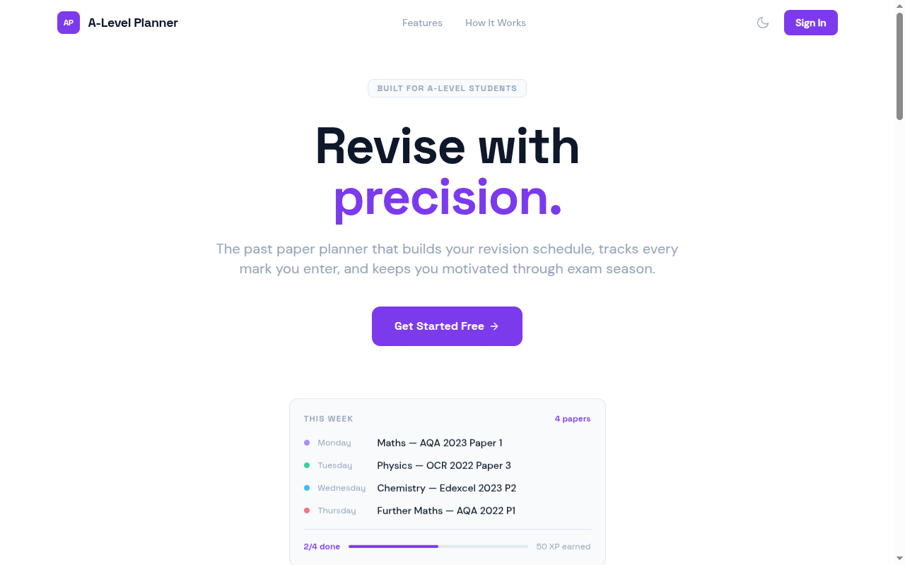
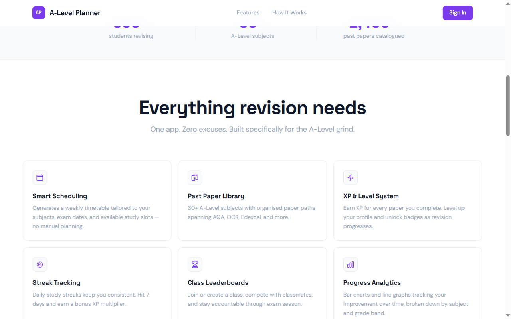
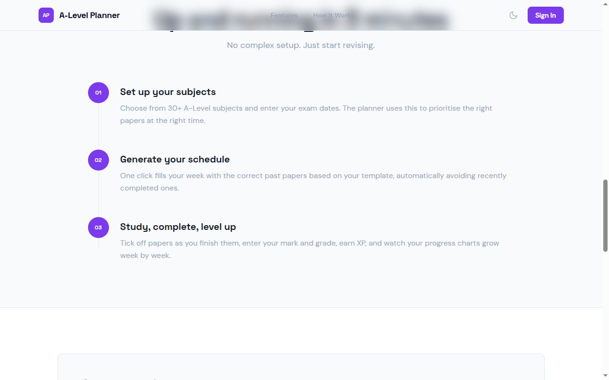
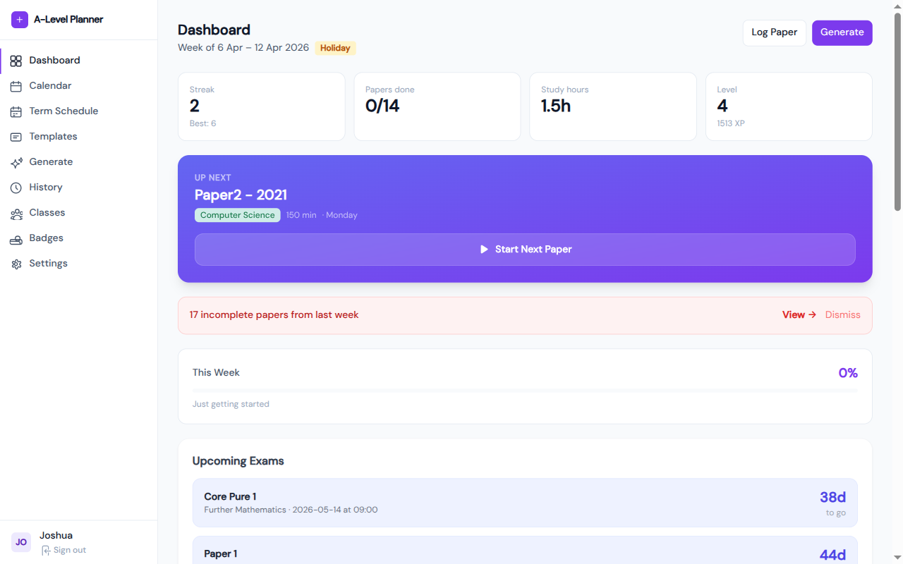
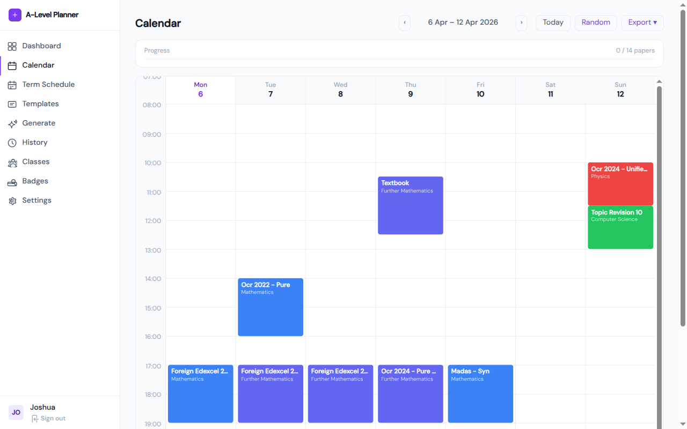
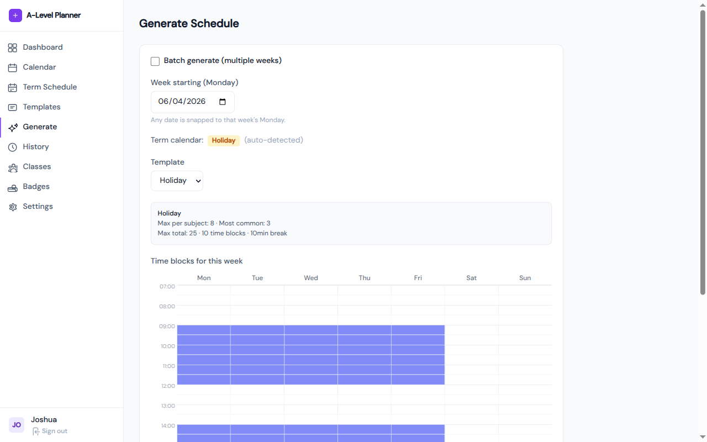
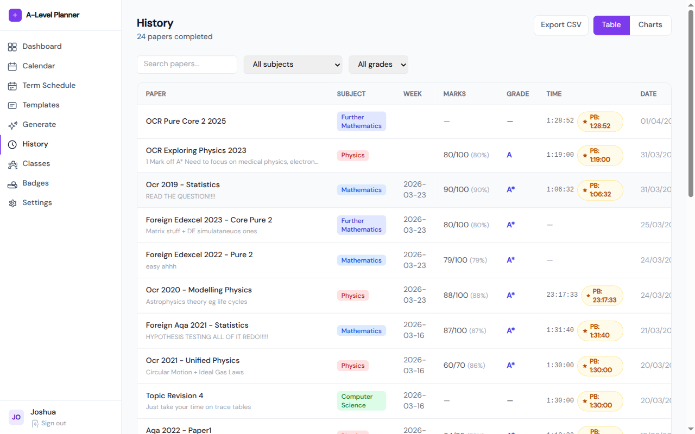
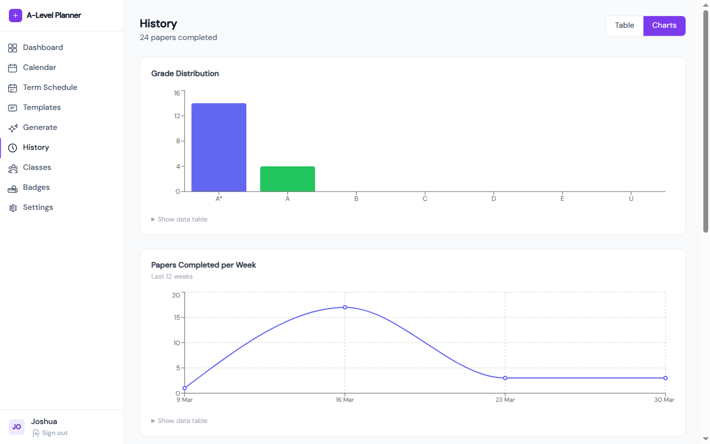
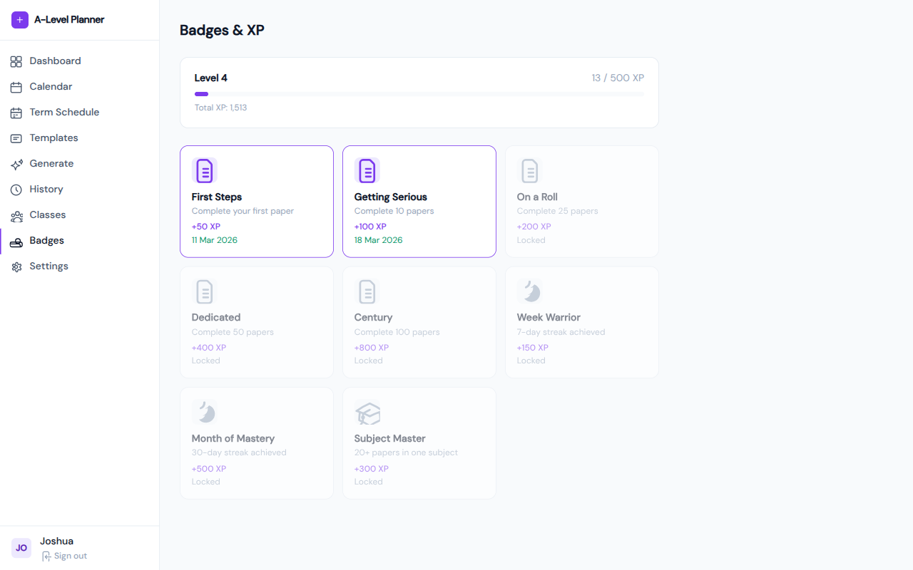

# A-Level Revision Planner

[](https://github.com/WithoutTheDot/alevel-revision-planner/actions/workflows/ci.yml)

**Live demo:** https://pastpapers-a8b7v6-f7f04.web.app/

A web app that builds past-paper revision schedules for A-Level students, tracks what you've done, and charts your marks over time. Built with React, Firebase, and Tailwind.

---

## Why I built this

During A-Level revision I kept losing track of which past papers I'd already done, picking new ones half at random, and had no real way to see if my marks were actually improving. This generates a weekly schedule based on real exam board paper structures, logs every result, and shows the trends.

---

## Screenshots

### Landing page






### Dashboard


### Weekly calendar


### Schedule generation


### History & analytics




### Badges & XP


---

## Features

### Scheduling
- Term calendar — mark weeks as Term A, Term B, or Holiday
- Time block templates — set your weekly availability (e.g. "Mon 4–6pm, Sat 9am–1pm")
- Auto-generate schedules — one click produces a week's worth of papers, weighted by exam structure
- Batch generation — generate multiple weeks at once
- Interactive weekly calendar — hour-based grid, drag-and-drop, export to clipboard

### Paper tracking
- Log any paper as complete with marks, grade, time taken, and notes
- Log from family — pick a paper family (e.g. "OCR Pure") and year, it auto-fills the name/duration and records the path so it won't get suggested again
- Start timer from log modal, fullscreen timer takes over and pre-fills elapsed time
- Full history table with search, filters, date range
- Export history to CSV
- Progress charts — marks over time, grade distribution per subject
- Personal best badge per paper, shown once a timed session exists
- PMT links on scheduled papers (question paper + mark scheme)

### Review mode
- Tag weak topics after a paper, or add them manually
- Review queue: Pending → Scheduled → Done
- Schedule a topic to a week, it shows up as a review block on the calendar
- Review page with the full queue grouped by status
- Topic frequency chart — most-struggled topics across all completed papers

### Gamification
- XP & levels, bonus XP for higher grades
- 8 badges (First Steps, Getting Serious, On a Roll, Dedicated, Century, Week Warrior, Month of Mastery, Subject Master)
- Streak tracking with longest-streak record
- Leaderboard — compare XP/papers/streaks with classmates
- Classes — join via invite code, nudge classmates who haven't studied recently

### Dashboard
- Exam countdown per subject
- "Up Next" card with a Start button
- This-week progress bar
- Streak, papers done, study hours, level at a glance
- Overdue papers banner

### Other stuff
- Fullscreen focus timer with pause/resume, personal best, overtime indicator
- Further Maths module selection (Statistics, Mechanics, Additional Pure, etc.) — scheduler weights accordingly
- Dark mode
- Onboarding wizard (subjects, exam dates, board per subject)
- Interactive first-login tutorial, replayable from Settings
- Email verification gate for new accounts
- Confetti on level-up
- Toast notifications, skeleton loading states, error boundary
- 105 built-in paper families across Maths, Further Maths, Physics, Chemistry, CS (AQA, OCR, Edexcel); custom families supported too
- PDF export of schedule
- Admin panel for managing users/classes

---

## Tech stack

| Layer | Technology |
|---|---|
| Frontend | React 19, Vite 7, React Router DOM 7 |
| Styling | Tailwind CSS 3, Framer Motion |
| Backend / DB | Firebase 12 — Firestore, Firebase Auth |
| Charts | Recharts |
| PDF | jsPDF + jsPDF-AutoTable |
| Drag & drop | react-beautiful-dnd |
| Date logic | date-fns |
| Testing | Vitest, Testing Library |
| Hosting | Firebase Hosting |

The scheduler (`src/lib/generateSchedule.js` + `paperTrees.js`) is the part I spent the most time on — each subject is a weighted decision tree, and the scheduler walks it with coverage-first weighting (0× if you did it this week, 0.01× recently, 0.05× ever, full weight if never attempted) then bin-packs the result into your available time blocks.

---

## Getting started

### Prerequisites
- Node.js 20+
- A Firebase project (Firestore + Authentication enabled)

### Setup

```bash
git clone https://github.com/WithoutTheDot/alevel-revision-planner.git
cd alevel-revision-planner
npm install --legacy-peer-deps
```

Copy the environment template and fill in your Firebase config:

```bash
cp .env.example .env
```

```
VITE_FIREBASE_API_KEY=...
VITE_FIREBASE_AUTH_DOMAIN=...
VITE_FIREBASE_PROJECT_ID=...
VITE_FIREBASE_STORAGE_BUCKET=...
VITE_FIREBASE_MESSAGING_SENDER_ID=...
VITE_FIREBASE_APP_ID=...
```

Deploy Firestore rules and indexes:

```bash
firebase deploy --only firestore
```

Start the dev server:

```bash
npm run dev
```

### Run tests

```bash
npm test
```

### Production build

```bash
npm run build
firebase deploy
```

---

## Project structure

```
src/
├── components/       # Shared UI (Modal, Layout, TimerWidget, FullscreenTimer…)
│   └── homepage/     # Landing page sections
├── contexts/         # AuthContext, SubjectsContext, TimerContext, ThemeContext
├── firebase/
│   └── db/           # Firestore helpers split by domain (papers, schedule, completion, review, social, profile…)
├── hooks/            # useAsyncData, useTimer, useDebounce
├── lib/              # builtInFamilies, paperTrees, generateSchedule, badges, gradeUtils, export helpers
└── pages/            # One file per route
```

---

## Environment variables

See `.env.example`. All vars are prefixed `VITE_` and consumed at build time by Vite — no server-side secrets, everything runs through Firebase SDKs with Firestore security rules enforcing access.

---

## Firestore data model

```
userPublicStats/{uid}
  └── xp, level, streak, papersCompleted, studyMinutes,
      subjectPapersCompleted, personalBests, badges

users/{uid}
  ├── profile/main      — displayName, subjects, onboardingComplete, furtherMathsModules
  ├── settings/main     — defaultPaperDuration, breakDuration, calendarHours, reviewModeEnabled
  ├── settings/durations — per-paperPath duration overrides
  ├── termCalendar/{weekId}       — week type (Term A / Term B / Holiday)
  ├── weeklySchedules/{weekId}    — array of scheduled paper slots
  ├── weekTemplates/{id}          — saved time block templates
  ├── completedPapers/{id}        — paperPath, marks, grade, comment, actualDurationSeconds, reviewTopics[], source, completedAt
  ├── customPapers/{familyId}     — user-created paper families
  ├── examTimetable/{id}          — exam name, subject, date/time
  └── reviewQueue/{id}            — topic, subject, status, scheduledWeekId

classes/{classId}
  └── name, joinCode, members[], leaderboard entries
```

---

## Testing

4 suites, run with Vitest and Testing Library — schedule generation constraints (statistical, 100-200 iterations per check since the scheduler is randomised), PMT link generation, paper family metadata, and a component test. CI runs lint → test → build on push/PR and auto-deploys to Firebase Hosting on merge to `main`.

---

## Ideas for later

Spaced-repetition-style weighting (papers you scored badly on come back more often), push notifications for scheduled papers, maybe a mobile version at some point.
